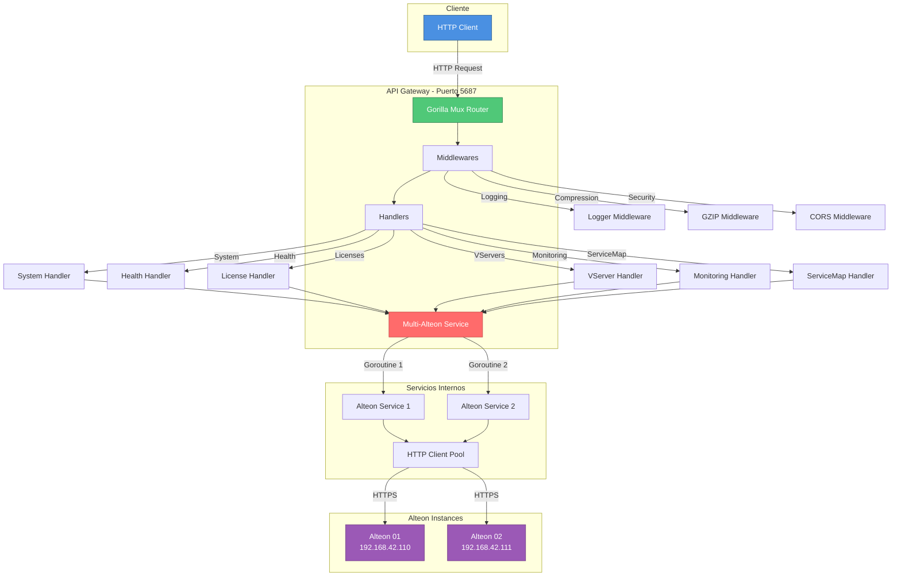
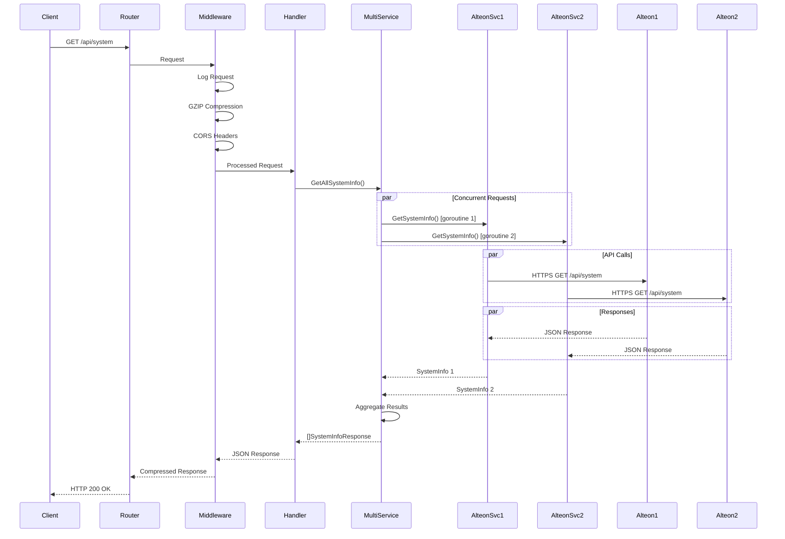

# Alteon API Gateway - Multi-Instance

<div align="center">


**API Gateway RESTful para gestión centralizada de múltiples instancias Radware Alteon**

[Características](#-características) •
[Instalación](#-instalación) •
[Endpoints](#-endpoints-api) •
[Arquitectura](#-arquitectura) •
[Configuración](#-configuración)

</div>

---

## 📋 Tabla de Contenido

- [Descripción General](#-descripción-general)
- [Características](#-características)
- [Requisitos](#-requisitos)
- [Instalación](#-instalación)
  - [Compilación](#1-compilación)
  - [Instalación como Servicio](#2-instalación-como-servicio-systemd)
  - [Configuración Manual](#3-configuración-manual)
- [Endpoints API](#-endpoints-api)
  - [Health Check](#1-health-check)
  - [System Information](#2-system-information)
  - [Licenses](#3-licenses)
  - [Virtual Servers](#4-virtual-servers)
  - [Monitoring](#5-monitoring)
  - [Service Map](#6-service-map)
- [Arquitectura](#-arquitectura)
  - [Diagrama de Componentes](#diagrama-de-componentes)
  - [Flujo de Peticiones](#flujo-de-peticiones)
  - [Estructura del Proyecto](#estructura-del-proyecto)
- [Configuración](#-configuración)
  - [Variables de Entorno](#variables-de-entorno)
  - [Configuración de Alteons](#configuración-de-alteons)
- [Middlewares](#-middlewares)
- [Gestión del Servicio](#-gestión-del-servicio)
- [Desarrollo](#-desarrollo)
- [Troubleshooting](#-troubleshooting)
- [Contribución](#-contribución)
- [Licencia](#-licencia)

---

## 🎯 Descripción General

**Alteon API Gateway** es un servicio RESTful desarrollado en Go que proporciona una interfaz unificada para gestionar y monitorear múltiples instancias de **Radware Alteon** (Application Delivery Controllers). 

El servicio permite:
- 🔄 **Consultas concurrentes** a múltiples Alteons usando goroutines
- 📊 **Agregación automática** de datos de todas las instancias
- 🚀 **Alto rendimiento** con conexiones HTTP persistentes y compresión GZIP
- 🔒 **Seguridad** con soporte para certificados SSL/TLS
- 📝 **Logging estructurado** en formato JSON
- 🎯 **Graceful shutdown** para operaciones seguras

---

## ✨ Características

| Característica | Descripción |
|---------------|-------------|
| **Multi-Instancia** | Gestiona múltiples Alteons desde un único endpoint |
| **Concurrencia** | Consultas paralelas usando goroutines y sync.WaitGroup |
| **HTTP/2** | Soporte completo para HTTP/2 con conexiones persistentes |
| **Compresión** | GZIP automático para reducir ancho de banda |
| **CORS** | Configurado para integraciones frontend |
| **Health Check** | Endpoint de salud para monitoreo y balanceadores |
| **Logging** | Logs estructurados en JSON con niveles configurables |
| **Systemd** | Instalación como servicio del sistema con auto-reinicio |
| **Warmup** | Precalentamiento de conexiones al iniciar |

---

## 📦 Requisitos

- **Go**: 1.25.3 o superior
- **Sistema Operativo**: Linux (Ubuntu/Debian/RHEL/CentOS)
- **Privilegios**: `sudo` para instalación como servicio
- **Red**: Conectividad a las instancias Alteon (HTTPS)
- **Puertos**: Puerto 5687 disponible (configurable)

### Dependencias Go

```go
require (
    github.com/gorilla/mux v1.8.1      // Router HTTP
    github.com/sirupsen/logrus v1.9.3  // Logging estructurado
)
```

---

## 🚀 Instalación

### 1. Compilación

```bash
# Clonar el repositorio
git clone <repository-url>
cd Alteon-Api-Multiple

# Descargar dependencias
go mod download

# Compilar el binario
go build -o alteon-api cmd/server/main.go

# Verificar compilación
./alteon-api --version
```

### 2. Instalación como Servicio (systemd)

El proyecto incluye un script de instalación automatizado que:
- ✅ Detiene y elimina servicios anteriores
- ✅ Copia el binario a `/opt/alteon-server-api`
- ✅ Configura permisos y variables de entorno
- ✅ Crea el servicio systemd
- ✅ Habilita auto-inicio en boot
- ✅ Inicia el servicio automáticamente

```bash
# Dar permisos de ejecución al script
chmod +x install-alteon-api.sh

# Ejecutar instalación (requiere sudo)
sudo ./install-alteon-api.sh
```

**Salida esperada:**
```
[INFO] Iniciando instalación del servicio alteon-server-api
[STEP] Verificando servicio existente
[STEP] Creando directorio /opt/alteon-server-api
[STEP] Verificando binario alteon-api...
[INFO] ✓ Binario encontrado: alteon-api
[STEP] Copiando archivos a /opt/alteon-server-api
[INFO] ✓ alteon-api copiado exitosamente
[STEP] Configurando permisos
[STEP] Creando archivo de servicio systemd
[STEP] Recargando systemd daemon
[STEP] Habilitando servicio alteon-server-api
[STEP] Iniciando servicio alteon-server-api
[INFO] ✅ Servicio alteon-server-api instalado y ejecutándose correctamente
```

### 3. Configuración Manual

Si prefieres no usar el script de instalación:

```bash
# Crear directorio de instalación
sudo mkdir -p /opt/alteon-server-api

# Copiar binario
sudo cp alteon-api /opt/alteon-server-api/

# Configurar permisos
sudo chmod +x /opt/alteon-server-api/alteon-api

# Crear archivo .env (ver sección Configuración)
sudo nano /opt/alteon-server-api/.env

# Crear servicio systemd manualmente
sudo nano /etc/systemd/system/alteon-server-api.service
```

---

## 🌐 Endpoints API

Base URL: `http://<host>:5687`

### 1. Health Check

Verifica el estado del servicio.

```http
GET /health
```

**Respuesta:**
```json
{
  "status": "ok",
  "timestamp": "2026-01-12T16:19:54Z"
}
```

**Códigos de Estado:**
- `200 OK`: Servicio operativo

---

### 2. System Information

Obtiene información del sistema de todos los Alteons configurados.

```http
GET /api/system
```

**Respuesta:**
```json
[
  {
    "alteon_name": "DELIZIA-ALTEON-01",
    "alteon_url": "https://192.168.42.110",
    "alteon_ip": "192.168.42.110",
    "sysName": "ALTEON-01",
    "agRtcTime": "14:30:45",
    "agRtcDate": "01/12/2026",
    "mpMemStatsFree": 2048576,
    "mpMemStatsTotal": 4194304,
    "agSwitchLastApplyTime": "2026-01-10 10:15:30",
    "agSwitchLastSaveTime": "2026-01-10 10:15:35",
    "agSwitchLastBootTime": "2026-01-01 08:00:00",
    "agSwitchUpTime": "11 days, 6:30:45",
    "agFipsSecurityLevel": "none",
    "agFipsNonApprovedMode": "disabled",
    "mgmtPortInfoIPv6SLAACTot": 0,
    "agMgmtCurCfgIpAddr": "192.168.42.110",
    "agMgmtCurCfgMask": "255.255.255.0",
    "agMgmtCurCfgGateway": "192.168.42.1",
    "agMgmtCurCfgIpv6Addr": "::",
    "agMgmtCurCfgIpv6PrefixLen": 0,
    "agMgmtCurCfgIpv6Gateway": "::",
    "hwMACAddress": "00:11:22:33:44:55"
  },
  {
    "alteon_name": "DELIZIA-ALTEON-02",
    "alteon_url": "https://192.168.42.111",
    "alteon_ip": "192.168.42.111",
    ...
  }
]
```

**Campos Principales:**

| Campo | Tipo | Descripción |
|-------|------|-------------|
| `alteon_name` | string | Nombre identificador del Alteon |
| `alteon_url` | string | URL base del Alteon |
| `alteon_ip` | string | Dirección IP extraída de la URL |
| `sysName` | string | Nombre del sistema |
| `agSwitchUpTime` | string | Tiempo de actividad |
| `mpMemStatsFree` | int | Memoria libre (bytes) |
| `mpMemStatsTotal` | int | Memoria total (bytes) |
| `agMgmtCurCfgIpAddr` | string | IP de gestión |

**Códigos de Estado:**
- `200 OK`: Datos obtenidos exitosamente
- `500 Internal Server Error`: No se pudo obtener información de ningún Alteon

---

### 3. Licenses

Obtiene información de licencias de todos los Alteons.

```http
GET /api/licenses
```

**Respuesta:**
```json
[
  {
    "alteon_name": "DELIZIA-ALTEON-01",
    "alteon_url": "https://192.168.42.110",
    "alteon_ip": "192.168.42.110",
    "licenses": [
      {
        "feature": "SSL",
        "status": "active",
        "expiration": "2027-12-31",
        "capacity": "unlimited"
      },
      {
        "feature": "AppWall",
        "status": "active",
        "expiration": "2027-12-31",
        "capacity": "100Mbps"
      }
    ]
  }
]
```

**Códigos de Estado:**
- `200 OK`: Licencias obtenidas exitosamente
- `500 Internal Server Error`: Error al obtener licencias

---

### 4. Virtual Servers

Obtiene la lista de servidores virtuales configurados.

```http
GET /api/virtualservers
```

**Respuesta:**
```json
[
  {
    "alteon_name": "DELIZIA-ALTEON-01",
    "alteon_url": "https://192.168.42.110",
    "alteon_ip": "192.168.42.110",
    "virtual_servers": [
      {
        "id": "vs1",
        "name": "WEB-SERVER-01",
        "ip": "10.0.0.100",
        "port": 80,
        "protocol": "http",
        "status": "enabled",
        "state": "up"
      },
      {
        "id": "vs2",
        "name": "HTTPS-SERVER-01",
        "ip": "10.0.0.100",
        "port": 443,
        "protocol": "https",
        "status": "enabled",
        "state": "up"
      }
    ]
  }
]
```

**Códigos de Estado:**
- `200 OK`: Virtual servers obtenidos exitosamente
- `500 Internal Server Error`: Error al obtener virtual servers

---

### 5. Monitoring

Obtiene métricas de monitoreo (CPU, memoria, cores) de todos los Alteons.

```http
GET /api/monitoring
```

**Respuesta:**
```json
[
  {
    "alteon_name": "DELIZIA-ALTEON-01",
    "alteon_url": "https://192.168.42.110",
    "alteon_ip": "192.168.42.110",
    "cpu": {
      "usage_percent": 45.2,
      "cores": 4,
      "load_average": [1.5, 1.2, 0.9]
    },
    "memory": {
      "total_mb": 4096,
      "used_mb": 2048,
      "free_mb": 2048,
      "usage_percent": 50.0
    },
    "cores": [
      {
        "core_id": 0,
        "usage_percent": 42.1,
        "memory_mb": 512
      },
      {
        "core_id": 1,
        "usage_percent": 48.3,
        "memory_mb": 512
      }
    ]
  }
]
```

**Códigos de Estado:**
- `200 OK`: Métricas obtenidas exitosamente
- `500 Internal Server Error`: Error al obtener métricas

---

### 6. Service Map

Obtiene el mapa de servicios completo (relación entre virtual servers, grupos y servidores reales).

```http
GET /api/servicemap
```

**Respuesta:**
```json
[
  {
    "alteon_name": "DELIZIA-ALTEON-01",
    "alteon_url": "https://192.168.42.110",
    "alteon_ip": "192.168.42.110",
    "timestamp": "2026-01-12T16:19:54Z",
    "status": "success",
    "vservers": [
      {
        "id": "vs1",
        "name": "WEB-SERVER-01",
        "ip": "10.0.0.100",
        "port": 80,
        "protocol": "http",
        "status": "enabled",
        "groups": [
          {
            "id": "grp1",
            "name": "WEB-POOL",
            "algorithm": "roundrobin",
            "servers": [
              {
                "id": "rs1",
                "ip": "192.168.1.10",
                "port": 8080,
                "status": "up",
                "weight": 1
              },
              {
                "id": "rs2",
                "ip": "192.168.1.11",
                "port": 8080,
                "status": "up",
                "weight": 1
              }
            ]
          }
        ]
      }
    ]
  }
]
```

**Códigos de Estado:**
- `200 OK`: Service map obtenido exitosamente
- `500 Internal Server Error`: Error al obtener service map

---

## 🏗 Arquitectura

### Diagrama de Componentes



### Flujo de Peticiones



### Estructura del Proyecto

```mermaid
graph LR
    subgraph "Proyecto Alteon-Api-Multiple"
        A[cmd/] --> A1[server/main.go]
        
        B[internal/] --> B1[config/]
        B --> B2[handler/]
        B --> B3[middleware/]
        B --> B4[models/]
        B --> B5[service/]
        
        B1 --> B1A[config.go]
        
        B2 --> B2A[health.go]
        B2 --> B2B[system.go]
        B2 --> B2C[license.go]
        B2 --> B2D[virtualserver.go]
        B2 --> B2E[monitoring.go]
        B2 --> B2F[servicemap.go]
        
        B3 --> B3A[logger.go]
        B3 --> B3B[gzip.go]
        B3 --> B3C[cors.go]
        
        B4 --> B4A[system.go]
        B4 --> B4B[license.go]
        B4 --> B4C[virtualserver.go]
        B4 --> B4D[monitoring.go]
        B4 --> B4E[servicemap.go]
        
        B5 --> B5A[alteon.go]
        B5 --> B5B[multi_alteon.go]
        B5 --> B5C[interface.go]
        B5 --> B5D[utils.go]
        
        C[pkg/] --> C1[httpclient/]
        C1 --> C1A[client.go]
        
        D[go.mod]
        E[go.sum]
        F[install-alteon-api.sh]
    end
    
    style A fill:#FFD700,stroke:#B8860B,color:#000
    style B fill:#87CEEB,stroke:#4682B4,color:#000
    style C fill:#98FB98,stroke:#228B22,color:#000
    style A1 fill:#FFA500,stroke:#FF8C00,color:#000
    style B5B fill:#FF6347,stroke:#DC143C,color:#fff
```



**Descripción de Directorios:**

| Directorio | Descripción |
|------------|-------------|
| `cmd/server/` | Punto de entrada de la aplicación (main.go) |
| `internal/config/` | Configuración de la aplicación y Alteons |
| `internal/handler/` | Handlers HTTP para cada endpoint |
| `internal/middleware/` | Middlewares (logging, GZIP, CORS) |
| `internal/models/` | Estructuras de datos (DTOs) |
| `internal/service/` | Lógica de negocio y comunicación con Alteons |
| `pkg/httpclient/` | Cliente HTTP reutilizable con configuración SSL |

---

## ⚙ Configuración

### Variables de Entorno

El servicio puede configurarse mediante archivo `.env` o variables de entorno del sistema.

**Archivo `.env` de ejemplo:**

```bash
# Configuración del servidor
SERVER_HOST=0.0.0.0
SERVER_PORT=5687

# Configuración de Alteon 1
ALTEON_BASE_URL=https://10.71.1.51
ALTEON_USERNAME=admin
ALTEON_PASSWORD=radware

# Logging
LOG_LEVEL=info  # debug, info, warn, error
LOG_FORMAT=json # json, text
```

### Configuración de Alteons

La configuración de múltiples Alteons se realiza en `internal/config/config.go`:

```go
func Load() *Config {
    return &Config{
        Server: ServerConfig{
            Host: "127.0.0.1",
            Port: "5687",
        },
        Alteons: []AlteonConfig{
            {
                Name:               "DELIZIA-ALTEON-01",
                BaseURL:            "https://192.168.42.110",
                Username:           "api",
                Password:           "apiDelizia4321.CLF",
                InsecureSkipVerify: true,
            },
            {
                Name:               "DELIZIA-ALTEON-02",
                BaseURL:            "https://192.168.42.111",
                Username:           "api",
                Password:           "apiDelizia4321.CLF",
                InsecureSkipVerify: true,
            },
        },
    }
}
```

**Parámetros de AlteonConfig:**

| Parámetro | Tipo | Descripción |
|-----------|------|-------------|
| `Name` | string | Nombre identificador único del Alteon |
| `BaseURL` | string | URL base (https://ip o hostname) |
| `Username` | string | Usuario de autenticación |
| `Password` | string | Contraseña de autenticación |
| `InsecureSkipVerify` | bool | Ignorar validación de certificados SSL |

---

## 🔧 Middlewares

### 1. Logging Middleware

Registra todas las peticiones HTTP con información detallada.

```go
middleware.LoggingMiddleware(logger)
```

**Log de ejemplo:**
```json
{
  "level": "info",
  "method": "GET",
  "path": "/api/system",
  "status": 200,
  "duration": "1.234s",
  "ip": "192.168.1.100",
  "user_agent": "Mozilla/5.0...",
  "timestamp": "2026-01-12T16:19:54Z"
}
```

### 2. GZIP Middleware

Comprime automáticamente las respuestas HTTP para reducir el ancho de banda.

```go
middleware.GzipMiddleware
```

**Beneficios:**
- Reducción de ~70-80% en tamaño de respuestas JSON
- Mejora en tiempos de transferencia
- Activación automática con header `Accept-Encoding: gzip`

### 3. CORS Middleware

Configura headers CORS para permitir integraciones frontend.

```go
middleware.CORSMiddleware
```

**Headers configurados:**
```
Access-Control-Allow-Origin: *
Access-Control-Allow-Methods: GET, POST, PUT, DELETE, OPTIONS
Access-Control-Allow-Headers: Content-Type, Authorization
```

---

## 🎮 Gestión del Servicio

### Comandos Systemd

```bash
# Ver estado del servicio
sudo systemctl status alteon-server-api

# Iniciar servicio
sudo systemctl start alteon-server-api

# Detener servicio
sudo systemctl stop alteon-server-api

# Reiniciar servicio
sudo systemctl restart alteon-server-api

# Habilitar auto-inicio en boot
sudo systemctl enable alteon-server-api

# Deshabilitar auto-inicio
sudo systemctl disable alteon-server-api

# Ver logs en tiempo real
sudo journalctl -u alteon-server-api -f

# Ver últimos 100 logs
sudo journalctl -u alteon-server-api -n 100

# Ver logs desde hoy
sudo journalctl -u alteon-server-api --since today
```

### Verificación de Salud

```bash
# Health check
curl http://localhost:5687/health

# Test de endpoint
curl http://localhost:5687/api/system | jq

# Con compresión GZIP
curl -H "Accept-Encoding: gzip" http://localhost:5687/api/system --compressed
```

---

## 👨‍💻 Desarrollo

### Configuración del Entorno de Desarrollo

```bash
# Clonar repositorio
git clone <repository-url>
cd Alteon-Api-Multiple

# Instalar dependencias
go mod download

# Ejecutar en modo desarrollo
go run cmd/server/main.go

# Ejecutar tests
go test ./...

# Ejecutar tests con cobertura
go test -cover ./...

# Generar reporte de cobertura
go test -coverprofile=coverage.out ./...
go tool cover -html=coverage.out
```

### Build Optimizado para Producción

```bash
# Build con optimizaciones
go build -ldflags="-s -w" -o alteon-api cmd/server/main.go

# Build con información de versión
VERSION=$(git describe --tags --always --dirty)
BUILD_TIME=$(date -u '+%Y-%m-%d_%H:%M:%S')
go build -ldflags="-s -w -X main.Version=$VERSION -X main.BuildTime=$BUILD_TIME" \
    -o alteon-api cmd/server/main.go

# Verificar tamaño del binario
ls -lh alteon-api
```

### Hot Reload con Air

```bash
# Instalar Air
go install github.com/cosmtrek/air@latest

# Ejecutar con hot reload
air
```

---

## 🔍 Troubleshooting

### Problema: Servicio no inicia

**Síntomas:**
```
systemctl status alteon-server-api
● alteon-server-api.service - Alteon Radware API Gateway Service
   Loaded: loaded
   Active: failed
```

**Soluciones:**

1. **Verificar logs:**
```bash
sudo journalctl -u alteon-server-api -n 50
```

2. **Verificar puerto en uso:**
```bash
sudo netstat -tulpn | grep 5687
# Si está en uso, cambiar puerto en config
```

3. **Verificar permisos:**
```bash
ls -l /opt/alteon-server-api/alteon-api
# Debe tener permisos de ejecución (rwxr-xr-x)
```

4. **Verificar conectividad a Alteons:**
```bash
curl -k https://192.168.42.110
```

---

### Problema: Error de conexión SSL

**Síntomas:**
```json
{
  "error": "x509: certificate signed by unknown authority"
}
```

**Solución:**

Configurar `InsecureSkipVerify: true` en `config.go`:

```go
AlteonConfig{
    Name:               "ALTEON-01",
    BaseURL:            "https://192.168.42.110",
    InsecureSkipVerify: true, // ← Agregar esto
}
```

---

### Problema: Timeouts en peticiones

**Síntomas:**
```json
{
  "error": "context deadline exceeded"
}
```

**Solución:**

Aumentar timeouts en `pkg/httpclient/client.go`:

```go
return &Client{
    Client: &http.Client{
        Transport: transport,
        Timeout:   60 * time.Second, // Aumentar de 30s a 60s
    },
}
```

---

### Problema: Alto uso de memoria

**Solución:**

Ajustar pool de conexiones en `pkg/httpclient/client.go`:

```go
transport := &http.Transport{
    MaxIdleConns:        50,  // Reducir de 100
    MaxIdleConnsPerHost: 25,  // Reducir de 100
    IdleConnTimeout:     60 * time.Second,
}
```

---

## 🤝 Contribución

Las contribuciones son bienvenidas. Por favor:

1. Fork el proyecto
2. Crea una rama para tu feature (`git checkout -b feature/AmazingFeature`)
3. Commit tus cambios (`git commit -m 'Add some AmazingFeature'`)
4. Push a la rama (`git push origin feature/AmazingFeature`)
5. Abre un Pull Request

### Estándares de Código

- Seguir [Effective Go](https://golang.org/doc/effective_go)
- Usar `gofmt` para formatear código
- Agregar tests para nuevas funcionalidades
- Documentar funciones públicas con comentarios

---

## 📄 Licencia

Este proyecto está bajo la Licencia MIT. Ver archivo `LICENSE` para más detalles.

---

<div align="center">

**Desarrollado con ❤️ usando Go 1.25.3**

[⬆ Volver arriba](#alteon-api-gateway---multi-instance)

</div>
